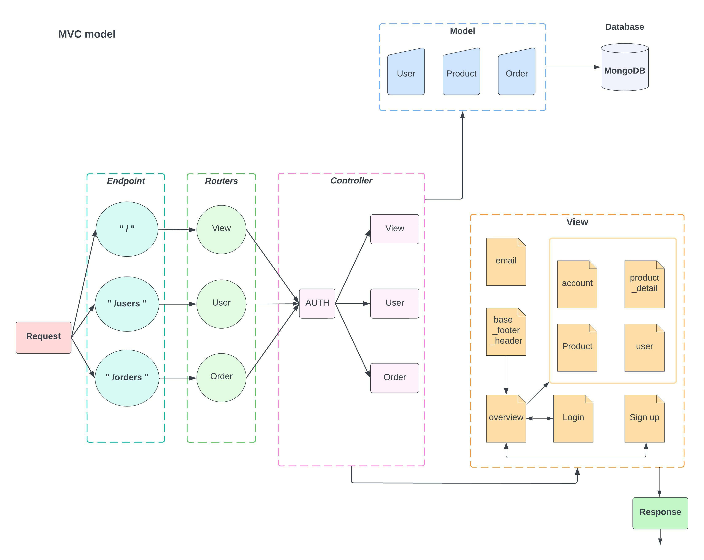

This is a group project for Software Engineering class

### **Introduction**

Fresh GO (Fresh Groceries Online) is a web app that allows people to online shop their groceries and other home goods

[Docker Image pushed to DockerHub](https://hub.docker.com/repository/docker/vod6atwit/fresh_go)

### **Features:**

Users can purchase products, create an account, log in and log out, with the ability to reset their password and update their data (name, photo, and email basically), with an improved user experience. An emailing feature is provided each time a user signup.

- Authentication
- Manage Users
- Manage Products
- Manage Orders

### **Architecture:**

 

**MVC architecture:**

The MVC architecture used here, is a way to structure the application development in three layers:

- <ins>Business logic layer:</ins> represented in Model folder, with mongoose schema choosing which information and data representing to clients and is the layer that the hole application build around.
- <ins>Application logic layer:</ins> represented in Controler folder, build around javascript functions to handle application's requests interact with models and send back response to clients.
- <ins>Presentation logic layer:</ins> represented in Views folder consists basically of the templates used to generate the view, so the website that we're going to send back to the clients.

 

### **Backend:**

- <ins>ExpressJs:</ins> for design Rest APIs, define middlewares, manage routings, HTTP request, error handling ...
- <ins>Mongoose:</ins> for data modeling, schema building, document middleware, and business logic
- <ins>MongoDB Atlas:</ins> for database hosting
- <ins>Nodemailer:</ins> Node module for sending emails to users (example: sign up, reset password, ...)
- <ins>cryptojs:</ins> for encrypt password and token
- <ins>JSON Web Token (JWT):</ins> for authenticate users
- <ins>Stripe:</ins> for online payments via bank card
- <ins>Multer:</ins> for uploading images
- <ins>Sharp:</ins> for converting large images to web friendly jpeg and resizing images
- <ins>Postman:</ins> for testing API

 

### **FrontEnd:**

- <ins>Javascript:</ins> for building APIs, and rendering user interfaces dynamically
- <ins>Axios:</ins> for fetching APIs
- <ins>Parcel-bundler:</ins> for web application bundling
- <ins>CSS:</ins> for styling the web application
- <ins>PUG:</ins> for building templates

 

### **How to Run:**

 

1. Go to [docker](https://www.docker.com/) and signup acct
2. Download docker desktop for your computer
3. Go to your terminal (MAC) / window console (Microsoft), then type in "docker", and if it runs without error, move to step 4
4. Stay in your terminal/window console, then type "docker login"
5. Using your acct of Docker to login
6. After all above step, run the command "docker run -p 8000:8000 vod6atwit/fresh_go"
7. Then navigate to your web browser and type: http://localhost:8000/

[Learn more about how to run Docker Image here](https://docs.docker.com/)

  
